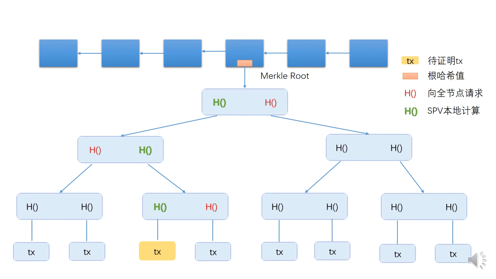

# 03-BTC-数据结构

- 哈希指针 (hash pointer): 保存地址和结构体的哈希值。
- 区块链 (block chain): a linked list using hash pointers.

- Merkle tree: 和 binary tree 不同的是，里面存放的都是哈希指针

每个区块分为两个部分：

- block header (包含着Merkle tree的root hash，没有交易的具体内容)
- block body (交易的列表)

Merkle tree 用途：提供 `Merkle proof` (从区块一直往上找到根节点的这条路径)，用来证明交易发生了。这种证明也叫做 `Proof of membership` 或者叫 `Proof of inclusion`

比特币中的节点分为两类：全节点（保存整个区块的内容）、轻节点（只保存block header）
