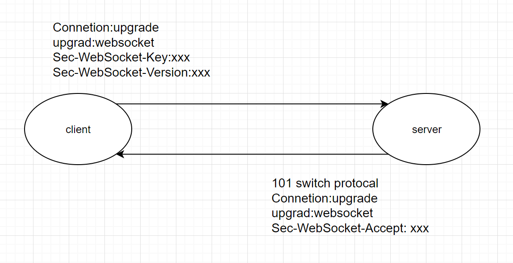

# WebSockets 入门

## 背景

对于 `HTTP` 协议来说，客户端没发送请求给服务端时，服务端是不会做出响应的。

如果要获取资源，必须不停的重复请求，这样资源消耗很大。所以，长轮询 `（Long polling）`出现了，它让客户端的请求保持持久连接，但此时，服务端不得不腾出资源提供给长轮询，即使没有数据的时候，也得保持连接，还好有了 `WebSockets`

## 概念

`WebSockets` 是专门用来做实时应用的协议，它在一开始依旧使用 `HTTP`，只不过后面保持 `TCP` 持久连接。

`WebSockets` 的请求 `URI` 用的是 `ws` 和 `wss`，在 `HTTP` 协议里，对应的就是 `http` 和 `https`

## 请求过程



1. 客户端如果要发起 `WebSockets` 请求，就需要在请求首部里做出说明：将 `Connection` 的值写成 `Upgrade`，`Upgrade` 的值写成 `websocket`
2. 服务器收到请求后就会看到连接要求升级，从 `Upgrade` 里找到要升级成的连接，于是服务器就知道客户端要建立 `WebSockets` 连接
3. 另外客户端还会在请求里加入 `Sec-WebSocket-key`，这个 `key` 提供给服务器来验证是否受到一个有效的 `WebSockets` 请求，另外还有 `Sec-WebSocket-Version` 用来指定版本号
4. 当服务器做出相应的时候，需要发出 `101 Switch Protocols` 的状态码，其中响应里的 `Connection` 和 `Upgrade` 首部值是和请求一样的，来表明验证了连接已经被升级了
5. 接着还会在响应中，加上 `Sec-WebSocket-Accept` 字段，它的值是根据请求里 `key` 的值来生成的
6. 建立连接后，开始传输数据

> 不同的客户端环境会导致请求首部的不同

## 示例一：websocket

服务端：

```js
const WebSocket = require("ws");
const wss = new WebSocket.Server({ port: 3000 });

// 事件
wss.on("connection", (ws) => {
  console.log("one people login");

  // 如果收到客户端发来的信息
  ws.on("message", (data) => {
    ws.send(data + " hello world");
  });

  // 单一连接中进行操作
  ws.on("close", () => {
    console.log("one people logout");
  });
});
```

客户端：

```html
<!DOCTYPE html>
<html lang="en">
  <head>
    <meta charset="UTF-8" />
    <meta http-equiv="X-UA-Compatible" content="IE=edge" />
    <meta name="viewport" content="width=device-width, initial-scale=1.0" />
    <title>websocket demo</title>
  </head>

  <body>
    <script>
      const ws = new WebSocket("ws://localhost:3000");

      // 监听事件
      ws.addEventListener("open", () => {
        console.log("connect successfully");
        ws.send("this is client message");
      });

      ws.addEventListener("message", ({ data }) => {
        console.log(data);
      });
    </script>
  </body>
</html>
```

## 示例二：socket.io

`socket.io` 这个库使用了 `WebSockets` 协议，但是对于不支持 `WebSockets` 协议的浏览器来说，会回退到 `HTTP` 轮询，而且提供自动重连功能。

服务端：

```js
const app = require("express")();
const server = require("http").createServer(app);
const io = require("socket.io")(server);
const path = require("path");

app.get("/", function (req, res) {
  res.sendFile("index.html", { root: path.join(__dirname) });
});

io.on("connection", (socket) => {
  console.log("一个人进来了");
  socket.on("chat message", (msg) => {
    io.emit("chat message", msg);
  });
  socket.on("disconnect", () => {
    console.log("一个人离开了");
  });
});

server.listen(3000);
```

客户端：

```html
<!DOCTYPE html>
<html lang="en">
  <head>
    <meta charset="UTF-8" />
    <meta http-equiv="X-UA-Compatible" content="IE=edge" />
    <meta name="viewport" content="width=device-width, initial-scale=1.0" />
    <title>socket io demo</title>
    <style></style>
  </head>

  <body>
    <form>
      <input type="text" />
      <button>发送</button>
    </form>

    <ul></ul>

    <script type="module">
      import { io } from "https://cdn.socket.io/4.3.2/socket.io.esm.min.js";
      const socket = io();

      const form = document.querySelector("form");
      const input = document.querySelector("input");
      const ul = document.querySelector("ul");

      form.addEventListener("submit", (e) => {
        e.preventDefault();
        if (input.value) {
          socket.emit("chat message", input.value);
          input.value = "";
        }
      });
      socket.on("chat message", (msg) => {
        const li = document.createElement("li");
        li.textContent = msg;
        ul.appendChild(li);
      });
    </script>
  </body>
</html>
```

这样我们就通过 `socket.io` 完成了一个简单的实时聊天室的功能了
